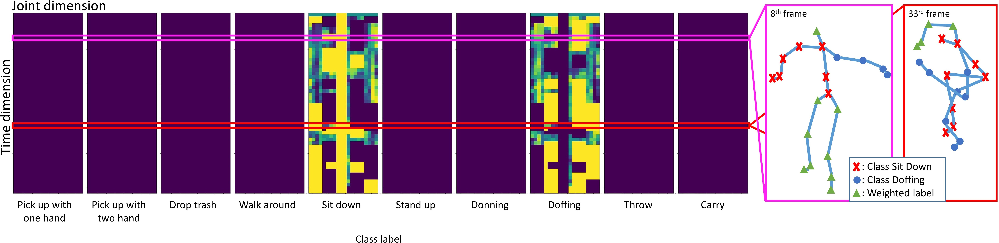

# Joint-wise Action Decomposition by Multi-action Recognition
## Dataset Description
This work utilize [N-UCLA](https://wangjiangb.github.io/my_data.html) dataset that provides 3D human skeleton data captured by Kinect camera. The dataset consist of 1494 samples of 10 action classes listed in Table~\ref{nucla_class}.
From the existing class of N-UCLA, we pair combinations of two actions and select the most realistic combination based on our judgment and the appearance of the data. 
For instance, since the "walk" class is predominantly performed by the lower part of the body, it would be realistic to merge it with an action primarily performed by the upper body. 
Due to the limitation of the class label and the importance of realistic combinations, this study only merges pairs of two classes.

<figure>
  
  <figcaption>Multi-action label example from merged action sit down and doffing.</figcaption>
</figure>

## Merging Process
Initially, we partition the body into six parts that are most likely to exhibit distinct movements: head, middle body, left arm, right arm, left leg, and right leg. We calculate the average motion of each body part to define the class label. 
For example, in the figure above, for the combination of action sit down and doffing, the \textcolor{red}{red X} in $8^{th}$ and $33^{rd}$ frame indicate joint with label sit down and \textcolor{blue}{blue circle} indicate joint with label doffing. 
We assign this clear label ($$\color{yellow}most yellow$$ regions or $$\color{violet}most dark purple$$ regions in the left part of the figure above) if the average motion of the corresponding body part in one sample label is greater than the other sample label if the difference between these two and the average motions exceeds a threshold $\tau$=0.01. 
If the difference between the average motion of two corresponding body parts is less than the threshold, we assign each joint label of this particular body part as weighted label based on the motion value for each joint, demonstrate with $$\color{green}green triangle$$ in the figure. 
We sample a maximum of 200 samples for each combination, resulting in a total of 1983 samples.

## Resources
Download the dataset [here](https://drive.google.com/file/d/1LiZotTZS3L7FugxDdtOIsrvduVvXR76o/view?usp=sharing)

